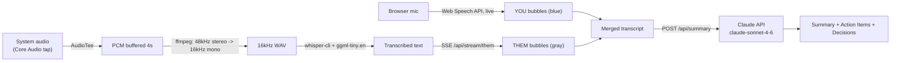

# Mimi 耳

Live meeting transcription - karaoke captions + AI summary. Tap the mic once and Mimi listens on two channels at the same time: your voice through the browser, and everyone else's through the Mac's system audio.

[](LICENSE)


## Features

- **Tap to start, both channels at once** - one tap grabs the mic and starts server-side system audio capture; no separate screen-share picker.
- **Karaoke-style live captions** - the last-recognized word pulses in the bottom bar as you speak, then lands as an iMessage-style bubble (blue = YOU, gray = THEM).
- **Two independent transcription engines** - YOU runs on the browser's Web Speech API (instant, no model download); THEM runs on-device through whisper.cpp for anything the system plays (Slack calls, Teams, YouTube).
- **Hallucination filtering** - strips whisper's bracketed noise artifacts (e.g. `(mumbling)`) before a line ever reaches the transcript.
- **Claude-generated meeting summary** - one click sends the merged transcript to Claude (`claude-sonnet-4-6`) and gets back a Summary / Action Items / Key Decisions writeup.
- **Save, copy, download** - the raw transcript writes straight to `~/Desktop`, or copies/downloads from the browser if the save endpoint is unreachable.
- **In-app setup and preflight checks** - live status for mic permission, screen-recording permission, whisper model presence, and Anthropic key, each with a one-tap fix (opens the right System Preferences pane, or an inline key field that writes `.env.local`).
- **MimiBar menu bar app** - a small Swift `NSStatusItem` app that polls the server every 4s and shows idle / capturing / stopped as a colored ear icon, with Open Mimi and Quit in its menu.
- **Launch at login** - `launchd` plists for both the transcription server and the menu bar app.

## How it works

Mimi runs two transcription paths in parallel and merges them into one timeline:



The server (`server.js`) is a single Node process with no framework: it serves `index.html`, keeps an `AudioTee` capture running continuously, and every 4 seconds pipes whatever system audio it buffered through `ffmpeg` (resample) and `whisper-cli` (transcribe), then pushes the result to the browser over Server-Sent Events. The mic channel never touches the server - `SpeechRecognition` runs entirely client-side in Chrome or Safari.

| Method | Path | Purpose |
|--------|------|---------|
| GET | `/` | Serves the single-page UI (`index.html`) |
| GET | `/api/stream/them` | SSE - pushes THEM (system audio) transcriptions as they finish |
| GET | `/api/session/status` | `capturing`, `modelReady`, `apiKeySet`, `audioTeeActive`, `uptime` - polled by MimiBar |
| POST | `/api/session/update` | Starts/stops the system-audio transcribe loop |
| POST | `/api/transcribe` | One-off webm -> wav -> whisper transcribe (mic fallback path) |
| POST | `/api/summary` | Sends the merged transcript to Claude, returns the summary |
| POST | `/api/save` | Writes a transcript to `~/Desktop` |
| GET | `/api/model-status` | Whether the whisper model file is present and large enough |
| POST | `/api/set-key` | Writes `ANTHROPIC_API_KEY` to `.env.local` from the in-app settings modal |
| POST | `/api/open-prefs` | Opens the macOS Privacy pane for microphone or screen recording |

## Tech stack

| Layer | Choice |
|-------|--------|
| Server | Plain Node.js `http` module, no framework (`server.js`) |
| YOU channel | Browser `SpeechRecognition` (Web Speech API) - client-side only |
| THEM channel | [`audiotee`](https://www.npmjs.com/package/audiotee) (Core Audio tap) -> `ffmpeg` (resample) -> `whisper-cli` with the `ggml-tiny.en` model ([whisper.cpp](https://github.com/ggerganov/whisper.cpp)) |
| Realtime push | Server-Sent Events (`/api/stream/them`) |
| AI summary | `@anthropic-ai/sdk`, model `claude-sonnet-4-6` |
| Frontend | One `index.html`, vanilla JS, no build step |
| Menu bar app | Swift (`MimiBar.swift`), `NSStatusItem`, polls `/api/session/status` every 4s |
| Persistence | None - transcripts write straight to `~/Desktop`; no database |
| Service | macOS `launchd` (`com.mimi.captions.plist` for the server, `com.mimi.menubar.plist` for MimiBar) |
| License | MIT |

## Getting started

Requirements: macOS, Chrome or Safari (Web Speech API), `whisper-cli` + `ffmpeg`.

```bash
git clone https://github.com/bunlongheng/mimi.git
cd mimi
npm install

brew install whisper-cpp ffmpeg

# whisper.cpp model for system audio transcription (~75MB)
mkdir -p models
curl -L "https://huggingface.co/ggerganov/whisper.cpp/resolve/main/ggml-tiny.en.bin" -o models/ggml-tiny.en.bin

# Anthropic key, for the Summarize feature
echo "ANTHROPIC_API_KEY=sk-ant-..." > .env.local

npm start
# → http://localhost:5757
```

`./start.sh` does the same `npm install` check, then opens the browser and starts the server in one step. First run will prompt for microphone and screen-recording permission (System Preferences > Privacy) - the in-app Settings panel shows the status of each requirement and links straight to the right pane if something is missing.

### MimiBar (menu bar status app)

A prebuilt `MimiBar` binary is checked into the repo. To rebuild it from `MimiBar.swift`:

```bash
swiftc MimiBar.swift -o MimiBar -framework Cocoa
```

### Launch at login

```bash
# transcription server
cp com.mimi.captions.plist ~/Library/LaunchAgents/
launchctl load ~/Library/LaunchAgents/com.mimi.captions.plist

# menu bar app
cp com.mimi.menubar.plist ~/Library/LaunchAgents/
launchctl load ~/Library/LaunchAgents/com.mimi.menubar.plist
```

Both plists point at a fixed `~/Sites/mimi` path and a specific user's home directory - edit the `ProgramArguments`, `WorkingDirectory`, and log paths to match your machine before loading them.

## License

[MIT](LICENSE) (c) Bunlong Heng
